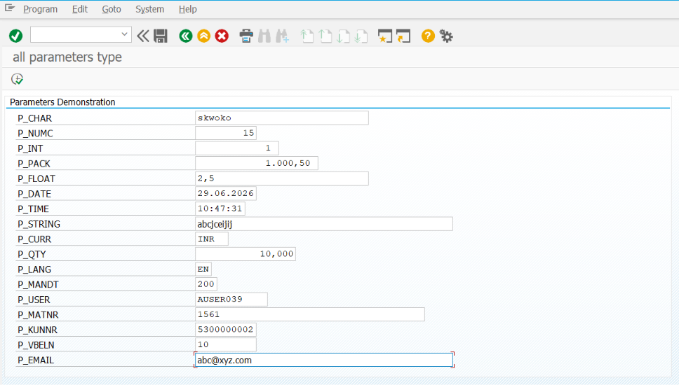
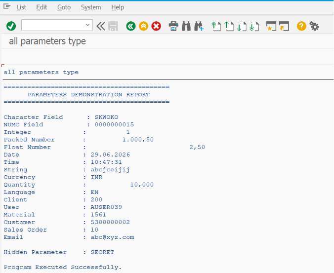

# ZSS_01_PARAMETERS

> Demonstrates how to use **PARAMETERS** in SAP ABAP Selection Screens with practical examples and SAP best practices.

---

# 📖 Overview

`ZSS_01_PARAMETERS` is the first program in the **SAP ABAP Selection Screen Cookbook** series.

This program introduces the `PARAMETERS` statement, which is used to accept **single-value input** from users on the SAP Selection Screen. It demonstrates the most commonly used parameter options, different data types, and standard techniques followed in real SAP ABAP projects.

This example serves as the foundation for understanding Selection Screen development before moving on to more advanced topics.

---

# 📚 Topics Covered

- PARAMETERS
- Character Fields
- Numeric Fields
- Date Fields
- Time Fields
- Integer Fields
- Packed Number Fields
- Currency Fields
- Quantity Fields
- Default Values
- Mandatory Fields (`OBLIGATORY`)
- Lower Case Input (`LOWER CASE`)
- Hidden Input (`NO-DISPLAY`)
- Selection Screen Blocks
- Comments
- Input Validation

---

# 🚀 Features Demonstrated

| Feature | Description |
|---------|-------------|
| PARAMETERS | Accept single-value input from the user |
| DEFAULT | Assign default values |
| OBLIGATORY | Make fields mandatory |
| LOWER CASE | Allow lowercase characters |
| NO-DISPLAY | Hide sensitive values such as passwords |
| BLOCK | Organize related fields into logical groups |
| COMMENT | Display descriptive text on the selection screen |
| Validation | Validate user input before report execution |

---

# 📸 Selection Screen

 

# 📄 Output Screen

> Add the Output Screen screenshot below.

# 💡 SAP Best Practices

- Use meaningful and consistent parameter names.
- Group related fields using selection screen blocks.
- Use text symbols instead of hard-coded text.
- Keep the selection screen simple and user-friendly.
- Validate all user inputs before executing business logic.
- Choose the appropriate data type for each parameter.
- Provide default values whenever they improve usability.
- Add comments to improve readability and maintenance.

---

# 📌 Notes

- `PARAMETERS` is designed to accept **only a single value** from the user.
- Use `SELECT-OPTIONS` when multiple values or ranges are required.
- Implement input validation using the `AT SELECTION-SCREEN` event.
- Organize fields into logical sections to improve the user experience.
- This example provides the basic building blocks used in almost every SAP ABAP report.