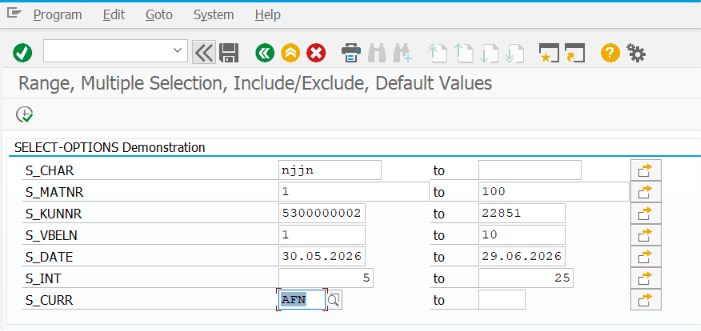
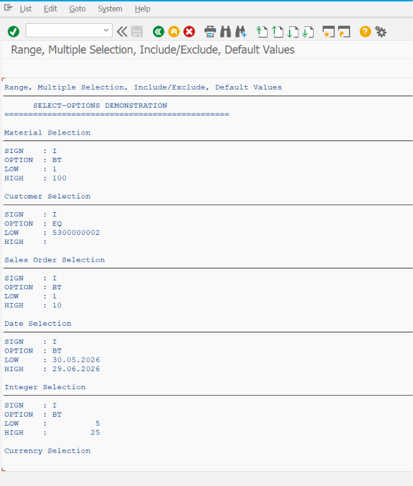

# ZSS_02_SELECT_OPTIONS

> Demonstrates how to use **SELECT-OPTIONS** in SAP ABAP Selection Screens to accept single values, multiple values, ranges, and exclusion criteria with practical examples and SAP best practices.

---

# 📖 Overview

`ZSS_02_SELECT_OPTIONS` is the second program in the **SAP ABAP Selection Screen Cookbook** series.

This program introduces the `SELECT-OPTIONS` statement, one of the most powerful features of SAP ABAP Selection Screens. It allows users to enter single values, multiple values, intervals (ranges), and exclusion criteria, making reports more flexible and user-friendly.

The program demonstrates how to create selection criteria for database fields, use standard search helps (F4), validate user input, and process the values entered by users.

---

# 📚 Topics Covered

- SELECT-OPTIONS
- Selection Table Structure
- LOW and HIGH Values
- SIGN Field (`Include` / `Exclude`)
- OPTION Field (`EQ`, `BT`, `CP`, `NE`, etc.)
- Single Value Selection
- Multiple Value Selection
- Range Selection
- Excluding Values
- Default Values
- Standard Search Help (F4)
- Input Validation
- Processing Selection Tables
- Looping Through Selection Tables
- Selection Screen Blocks
- Comments

---

# 🚀 Features Demonstrated

| Feature | Description |
|---------|-------------|
| SELECT-OPTIONS | Accept multiple values and value ranges |
| Include Values | Filter records to include specific values |
| Exclude Values | Exclude specific values from selection |
| Range Selection | Select values between LOW and HIGH |
| Multiple Selections | Enter multiple individual values |
| Selection Table | Process SIGN, OPTION, LOW, and HIGH values |
| Default Values | Prepopulate selection criteria |
| Standard F4 Help | Use SAP Dictionary search help automatically |
| Validation | Validate entered values before execution |
| LOOP AT | Read and process selection table entries |

---

# 📸 Selection Screen

> **Selection Screen Screenshot**

Add the screenshot below.

```markdown

```

---

# 📄 Output Screen

> **Output Screen Screenshot**

Add the screenshot below.

```markdown

```

---

# 💡 SAP Best Practices

- Use `SELECT-OPTIONS` whenever users need to enter multiple values or ranges.
- Define `SELECT-OPTIONS` using SAP Dictionary fields to inherit data type and standard search help.
- Validate user input using `AT SELECTION-SCREEN`.
- Provide meaningful labels and organize fields using blocks.
- Avoid unnecessary looping through selection tables when direct usage is sufficient.
- Use default values to improve user experience where appropriate.
- Handle both Include (`I`) and Exclude (`E`) selections correctly.
- Understand the meaning of `SIGN`, `OPTION`, `LOW`, and `HIGH` before processing the selection table.

---

# 📌 Notes

- `SELECT-OPTIONS` creates an internal selection table with four fields:
  - `SIGN`
  - `OPTION`
  - `LOW`
  - `HIGH`
- Unlike `PARAMETERS`, `SELECT-OPTIONS` supports multiple entries, ranges, and exclusion criteria.
- Standard SAP search help (F4) is automatically available when using Dictionary fields.
- The most commonly used options are:
  - `EQ` (Equal)
  - `NE` (Not Equal)
  - `BT` (Between)
  - `GE` (Greater Than or Equal)
  - `LE` (Less Than or Equal)
  - `CP` (Contains Pattern)
- `SIGN = I` includes matching values, while `SIGN = E` excludes matching values.
- The selection table can be processed using `LOOP AT` to implement custom business logic.
- `SELECT-OPTIONS` is widely used in SAP standard reports because it provides flexible filtering capabilities with minimal coding.