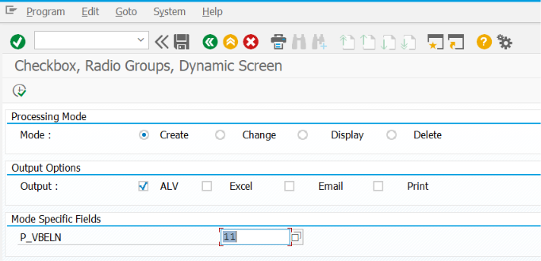
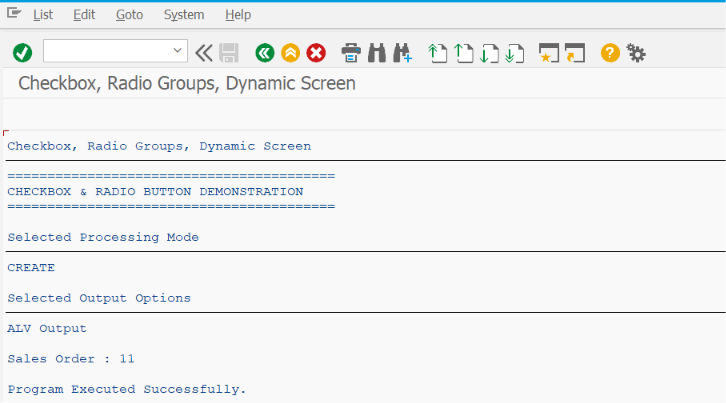

# ZSS_03_CHECKBOX_RADIO

> Demonstrates how to use **Checkboxes** and **Radio Buttons** in SAP ABAP Selection Screens to capture user choices, control report behavior, and implement conditional processing using SAP best practices.

---

# 📖 Overview

`ZSS_03_CHECKBOX_RADIO` is the third program in the **SAP ABAP Selection Screen Cookbook** series.

This program introduces two commonly used Selection Screen controls: **Checkboxes** and **Radio Buttons**. These controls allow users to make boolean selections or choose one option from a group of mutually exclusive choices.

The example demonstrates how to create checkboxes and radio button groups, assign default selections, validate user choices, and use the selected values to control report execution and business logic.

---

# 📚 Topics Covered

- Checkboxes
- Radio Buttons
- Radio Button Groups
- Default Selection
- Multiple Checkboxes
- Single Selection using Radio Buttons
- Boolean Input Handling
- Conditional Processing
- User Selection Validation
- Selection Screen Comments
- Selection Screen Layout
- Selection Screen Blocks
- Dynamic Processing Based on User Selection

---

# 🚀 Features Demonstrated

| Feature | Description |
|---------|-------------|
| Checkbox | Accept Yes/No (Boolean) input from the user |
| Radio Button | Allow users to select only one option from a group |
| RADIOBUTTON GROUP | Group related radio buttons together |
| DEFAULT | Set a default selected option |
| Conditional Logic | Execute different business logic based on user selection |
| COMMENT | Display descriptive labels on the selection screen |
| BLOCK | Organize radio buttons and checkboxes into logical sections |
| Validation | Ensure valid user selections before report execution |

---

# 📸 Selection Screen

> **Selection Screen Screenshot**

Add the screenshot below.

```markdown

```

---

# 📄 Output Screen

> **Output Screen Screenshot**

Add the screenshot below.

```markdown

```

---

# 💡 SAP Best Practices

- Use **Radio Buttons** when only one option should be selected.
- Use **Checkboxes** when multiple independent options can be selected.
- Always assign meaningful labels to improve readability.
- Set the most frequently used option as the default selection.
- Group related controls inside Selection Screen Blocks.
- Keep radio button groups small and easy to understand.
- Use conditional processing instead of complex nested IF statements where possible.
- Validate mandatory business selections before processing.
- Use text symbols instead of hard-coded labels.
- Keep the selection screen simple and user-friendly.

---

# 📌 Notes

- A checkbox stores only two possible values:
  - `'X'` → Selected
  - `' '` (Blank) → Not Selected
- Multiple checkboxes can be selected at the same time because each checkbox is independent.
- Radio Buttons are mutually exclusive; only one button in a radio button group can be selected.
- Every Radio Button must belong to a `RADIOBUTTON GROUP`.
- One Radio Button in a group should usually be marked as the default selection.
- Checkboxes are commonly used for optional report settings such as:
  - Display Header
  - Show Deleted Records
  - Export to Excel
  - Enable Logging
- Radio Buttons are commonly used for selecting report modes such as:
  - Create
  - Change
  - Display
  - Summary
  - Detailed Report
- The selected values can be used to dynamically control report logic and screen behavior.