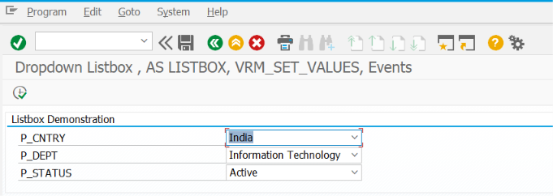
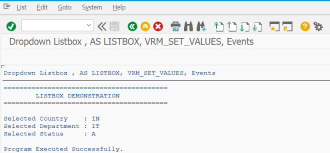

# ZSS_04_LISTBOX

> Demonstrates how to use **List Boxes (Dropdown Lists)** in SAP ABAP Selection Screens to provide predefined user choices, improve data consistency, and simplify user input using SAP best practices.

---

# 📖 Overview

`ZSS_04_LISTBOX` is the fourth program in the **SAP ABAP Selection Screen Cookbook** series.

This program introduces the **List Box (Dropdown List)** control available in SAP ABAP Selection Screens. A List Box allows users to select a value from a predefined list instead of manually typing input, reducing data entry errors and improving the overall user experience.

The example demonstrates how to create a List Box, populate it dynamically using function modules, assign default values, validate user selections, and process the selected value during report execution.

---

# 📚 Topics Covered

- List Box (Dropdown)
- `AS LISTBOX`
- `VISIBLE LENGTH`
- Default Selection
- Dynamic List Population
- Static List Population
- Function Module `VRM_SET_VALUES`
- Type Pool `VRM`
- Value-Key Mapping
- Selection Validation
- Processing Selected Values
- Selection Screen Blocks
- Comments
- User-Friendly Input Controls

---

# 🚀 Features Demonstrated

| Feature | Description |
|---------|-------------|
| AS LISTBOX | Display a parameter as a dropdown list |
| VISIBLE LENGTH | Control the visible width of the dropdown |
| Default Value | Set a default selected option |
| Dynamic Values | Populate the dropdown during program initialization |
| Static Values | Create a predefined list of options |
| VRM_SET_VALUES | Populate List Box values using SAP standard function module |
| Key-Value Mapping | Store technical values while displaying meaningful descriptions |
| Validation | Validate the selected option before report execution |
| Conditional Processing | Execute different logic based on the selected value |
| Organized Layout | Display List Boxes inside blocks with descriptive comments |

---

# 📸 Selection Screen

# 📄 Output Screen

# 💡 SAP Best Practices

- Use List Boxes when users should choose from a limited set of predefined values.
- Keep the number of dropdown values reasonable for better usability.
- Display meaningful descriptions instead of technical codes whenever possible.
- Populate dropdown values dynamically using `VRM_SET_VALUES`.
- Assign a sensible default value to improve the user experience.
- Validate the selected value before processing business logic.
- Group related dropdowns inside selection screen blocks.
- Use text symbols instead of hard-coded labels.
- Avoid using a List Box when the number of values is very large; use Search Help (F4) instead.
- Keep dropdown values sorted and easy to understand.

---

# 📌 Notes

- A List Box is created using the `AS LISTBOX` addition with the `PARAMETERS` statement.
- The `VISIBLE LENGTH` addition controls the width of the dropdown displayed on the Selection Screen.
- Dropdown values are typically populated during the `INITIALIZATION` event using the `VRM_SET_VALUES` function module.
- Each List Box entry consists of:
  - **Key** – Technical value stored in the parameter.
  - **Text** – Description displayed to the user.
- List Boxes are ideal for small, fixed sets of values such as:
  - Report Type
  - Order Status
  - Language
  - Company Code Category
  - Processing Mode
- For large datasets such as Materials, Customers, or Vendors, use Search Help (F4) instead of a List Box.
- The selected key value can be used to control report logic, database queries, or screen behavior dynamically.