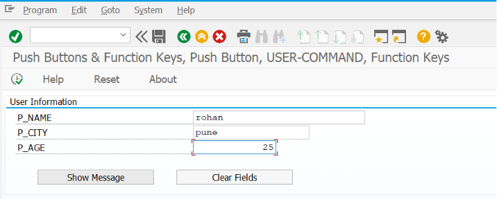
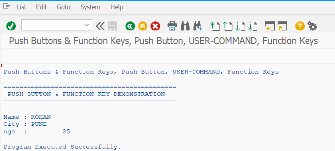

# ZSS_05_PUSHBUTTON_FUNCTIONKEY

> Demonstrates how to use **Push Buttons** and **Function Keys** in SAP ABAP Selection Screens to perform custom actions, trigger events, navigate users, and enhance report usability using SAP best practices.

---

# 📖 Overview

`ZSS_05_PUSHBUTTON_FUNCTIONKEY` is the fifth program in the **SAP ABAP Selection Screen Cookbook** series.

This program introduces **Push Buttons** and **Function Keys**, two powerful Selection Screen features that allow users to perform custom actions without executing the report. These controls are commonly used to display help information, reset input fields, navigate to transactions, open documentation, trigger validations, or execute custom business logic.

The example demonstrates how to create Push Buttons and Function Keys, assign custom function codes, handle user actions using Selection Screen events, and improve the overall user experience of SAP reports.

---

# 📚 Topics Covered

- Selection Screen Push Buttons
- Function Keys
- USER-COMMAND
- SSCRFIELDS Structure
- Function Code Handling
- Custom Button Labels
- Push Button Events
- Function Key Events
- Event `AT SELECTION-SCREEN`
- Event `AT SELECTION-SCREEN ON EXIT-COMMAND`
- Custom Navigation
- Reset Selection Screen
- Display Information Popup
- Selection Screen Comments
- Selection Screen Layout

---

# 🚀 Features Demonstrated

| Feature | Description |
|---------|-------------|
| PUSHBUTTON | Add custom buttons to the Selection Screen |
| FUNCTION KEY | Create toolbar function keys (F1–F5) |
| USER-COMMAND | Assign custom function codes to buttons |
| SSCRFIELDS-UCOMM | Identify which button or function key was pressed |
| Custom Actions | Execute business logic without running the report |
| Navigation | Trigger navigation to other reports or transactions |
| Reset Screen | Clear or reset user input fields |
| Information Popup | Display messages or help information |
| Event Handling | Process Push Button and Function Key actions |
| Improved UX | Provide shortcuts for frequently used actions |

---

# 📸 Selection Screen

# 📄 Output Screen

# 💡 SAP Best Practices

- Assign meaningful labels to Push Buttons and Function Keys.
- Use descriptive function codes for easier maintenance.
- Keep the number of buttons limited to avoid cluttering the Selection Screen.
- Use Push Buttons for actions that do not require report execution.
- Use Function Keys for frequently used shortcuts such as Help, Reset, or Documentation.
- Handle all button actions using `SSCRFIELDS-UCOMM`.
- Display user-friendly messages after custom actions.
- Keep navigation logic separate from report processing logic.
- Use text symbols instead of hard-coded button labels.
- Validate user input before executing custom business logic where required.

---

# 📌 Notes

- Push Buttons are created using the `SELECTION-SCREEN PUSHBUTTON` statement.
- Each Push Button is assigned a unique `USER-COMMAND` that identifies the action performed.
- Function Keys appear in the Selection Screen application toolbar and can be configured using the `SELECTION-SCREEN FUNCTION KEY` statement.
- User actions are identified through the `SSCRFIELDS-UCOMM` field.
- Common uses of Push Buttons include:
  - Display Help
  - Clear Input Fields
  - Load Default Values
  - Open Documentation
  - Preview Data
  - Execute Custom Validation
- Common uses of Function Keys include:
  - Reset Screen
  - Navigate to Another Report
  - Download Template
  - Upload File
  - Display Report Information
- Push Buttons improve report usability by allowing users to perform actions without leaving the Selection Screen.
- Push Buttons and Function Keys should be used only for meaningful actions that simplify the user's workflow.