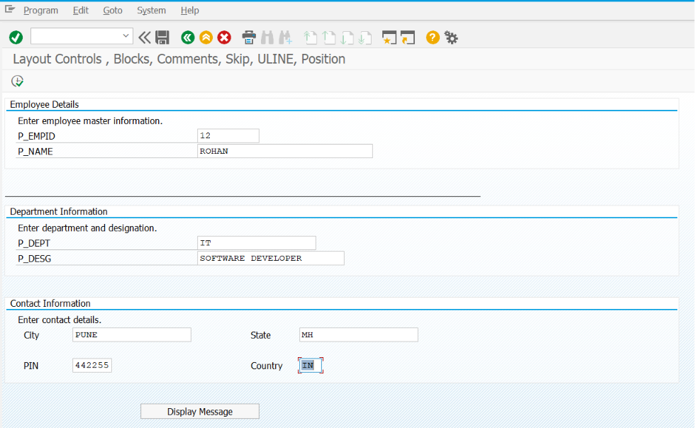
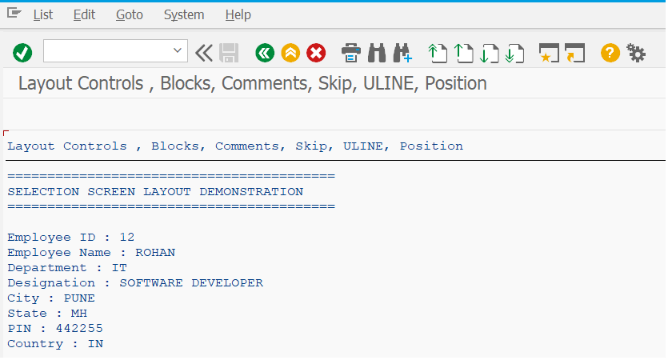

# ZSS_06_BLOCK_COMMENT

> Demonstrates how to organize SAP ABAP Selection Screens using **Blocks**, **Frames**, **Titles**, **Comments**, **Lines**, **Positions**, and **Layout Elements** to create clean, structured, and user-friendly report interfaces.

---

# 📖 Overview

`ZSS_06_BLOCK_COMMENT` is the sixth program in the **SAP ABAP Selection Screen Cookbook** series.

This program demonstrates how to improve the appearance and usability of SAP ABAP Selection Screens by organizing input fields into logical sections using **Selection Screen Blocks** and adding descriptive **Comments**. It also covers layout elements such as horizontal lines, field positioning, blank spaces, and labels to create professional-looking report screens.

Well-designed selection screens help business users quickly understand the purpose of each input field, reduce data entry errors, and improve the overall user experience.

---

# 📚 Topics Covered

- Selection Screen Blocks
- Block Frames
- Block Titles
- `BEGIN OF BLOCK`
- `END OF BLOCK`
- Selection Screen Comments
- `SELECTION-SCREEN COMMENT`
- Horizontal Lines
- `SELECTION-SCREEN ULINE`
- Blank Lines
- `SELECTION-SCREEN SKIP`
- Field Positioning
- `SELECTION-SCREEN POSITION`
- `BEGIN OF LINE`
- `END OF LINE`
- Text Symbols
- Screen Layout Organization
- User-Friendly Screen Design

---

# 🚀 Features Demonstrated

| Feature | Description |
|---------|-------------|
| BLOCK | Group related fields into logical sections |
| FRAME | Display a border around each block |
| TITLE | Display a meaningful title for every block |
| COMMENT | Display static labels, instructions, or descriptions |
| ULINE | Draw horizontal separator lines |
| SKIP | Add blank lines between sections |
| POSITION | Control the placement of screen elements |
| BEGIN OF LINE | Place multiple elements on the same line |
| END OF LINE | End a custom line layout |
| Text Symbols | Store titles and comments separately from code |
| Structured Layout | Improve readability of the Selection Screen |
| Professional UI | Create clean and organized report screens |

---

# 📸 Selection Screen

> **Selection Screen Screenshot**

Add the screenshot below.

```markdown

```

---

# 📄 Output Screen

> **Output Screen Screenshot**

Add the screenshot below.

```markdown

```

---

# 💡 SAP Best Practices

- Divide large Selection Screens into multiple logical blocks.
- Always provide meaningful titles for each block.
- Use frames to visually separate different sections.
- Add comments to explain fields or provide user instructions.
- Use horizontal lines to separate major sections of the screen.
- Avoid overcrowding the Selection Screen with too many fields in a single block.
- Align related fields on the same line where appropriate.
- Use text symbols instead of hard-coded labels and titles to support translations.
- Keep the screen layout consistent across all reports within a project.
- Design Selection Screens with business users in mind, prioritizing readability and simplicity.

---

# 📌 Notes

- `BEGIN OF BLOCK` and `END OF BLOCK` are used to group related Selection Screen elements.
- Adding the `WITH FRAME TITLE` addition displays a bordered section with a descriptive title.
- `SELECTION-SCREEN COMMENT` displays static text such as instructions, labels, or informational messages.
- `SELECTION-SCREEN ULINE` creates a horizontal line to visually separate screen sections.
- `SELECTION-SCREEN SKIP` inserts blank lines to improve spacing and readability.
- `SELECTION-SCREEN POSITION` allows precise placement of fields, comments, and buttons.
- `BEGIN OF LINE` and `END OF LINE` are useful for displaying multiple controls on a single row.
- Text symbols should be used for all titles and comments to support multilingual SAP systems.
- Properly organized Selection Screens improve usability, reduce user errors, and provide a consistent interface across SAP custom reports.
- Nearly all SAP standard reports use blocks, comments, and layout elements to create structured and easy-to-use Selection Screens.