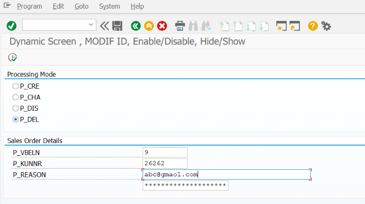
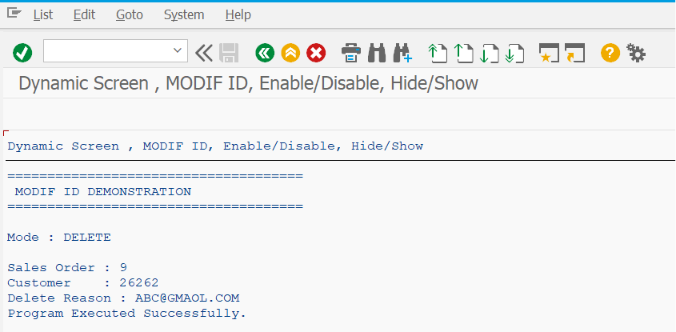

# ZSS_07_MODIF_ID

> Demonstrates how to use **MODIF ID** in SAP ABAP Selection Screens to dynamically show, hide, enable, disable, and control input fields based on user selections, creating interactive and user-friendly reports.

---

# 📖 Overview

`ZSS_07_MODIF_ID` is the seventh program in the **SAP ABAP Selection Screen Cookbook** series.

This program introduces one of the most powerful Selection Screen features in SAP ABAP—**MODIF ID**. It allows developers to dynamically control the appearance and behavior of Selection Screen elements during runtime.

The example demonstrates how to assign modification groups to fields, use `LOOP AT SCREEN`, modify screen attributes with `MODIFY SCREEN`, and dynamically show, hide, enable, or disable fields based on user selections such as Radio Buttons and Checkboxes.

Dynamic Selection Screens improve usability by displaying only the fields that are relevant to the selected business scenario.

---

# 📚 Topics Covered

- MODIF ID
- Dynamic Selection Screens
- Screen Modification
- `LOOP AT SCREEN`
- `MODIFY SCREEN`
- Screen Attributes
- `SCREEN-GROUP1`
- `SCREEN-ACTIVE`
- `SCREEN-INPUT`
- `SCREEN-INVISIBLE`
- `SCREEN-REQUIRED`
- `AT SELECTION-SCREEN OUTPUT`
- Dynamic Field Visibility
- Dynamic Field Enable/Disable
- Conditional Screen Processing
- Interactive Selection Screens

---

# 🚀 Features Demonstrated

| Feature | Description |
|---------|-------------|
| MODIF ID | Assign fields to modification groups |
| SCREEN-GROUP1 | Identify fields belonging to a specific MODIF ID |
| LOOP AT SCREEN | Read all Selection Screen elements at runtime |
| MODIFY SCREEN | Apply dynamic changes to screen elements |
| SCREEN-ACTIVE | Show or hide screen elements |
| SCREEN-INPUT | Enable or disable user input |
| SCREEN-INVISIBLE | Make fields invisible |
| SCREEN-REQUIRED | Dynamically make fields mandatory |
| Dynamic Validation | Display fields only when required |
| Conditional Layout | Change screen behavior based on business rules |
| Interactive UI | Improve user experience with dynamic screens |

---

# 📸 Selection Screen

# 📄 Output Screen

# 💡 SAP Best Practices

- Assign meaningful MODIF IDs based on functional groups (e.g., `SAL`, `PUR`, `ADV`).
- Perform all dynamic screen changes inside `AT SELECTION-SCREEN OUTPUT`.
- Keep the number of modification groups manageable and well documented.
- Use `SCREEN-GROUP1` instead of hard-coding field names whenever possible.
- Hide or disable only fields that are not applicable to the selected business process.
- Use `SCREEN-REQUIRED` carefully to dynamically enforce mandatory input.
- Keep dynamic screen logic simple and easy to maintain.
- Combine MODIF ID with Radio Buttons or Checkboxes for better user interaction.
- Test all possible user selections to ensure fields appear and behave correctly.
- Use text symbols for labels and comments to support multilingual environments.

---

# 📌 Notes

- `MODIF ID` assigns a field to a modification group that can be controlled programmatically.
- Dynamic screen modification is performed in the `AT SELECTION-SCREEN OUTPUT` event.
- `LOOP AT SCREEN` reads each screen element, allowing its attributes to be changed before the Selection Screen is displayed.
- `MODIFY SCREEN` applies changes made to the current screen element.
- Common screen attributes include:
  - `SCREEN-ACTIVE` → Show or hide a field.
  - `SCREEN-INPUT` → Enable or disable editing.
  - `SCREEN-INVISIBLE` → Hide the field from the user.
  - `SCREEN-REQUIRED` → Make a field mandatory at runtime.
- MODIF ID is widely used in SAP standard reports to display only relevant fields based on user selections.
- Dynamic Selection Screens reduce user confusion by hiding unnecessary fields and simplifying data entry.
- MODIF ID can be combined with:
  - Radio Buttons
  - Checkboxes
  - List Boxes
  - Push Buttons
  - Selection Screen Blocks
- Proper use of MODIF ID results in cleaner, more intuitive, and easier-to-maintain Selection Screens.