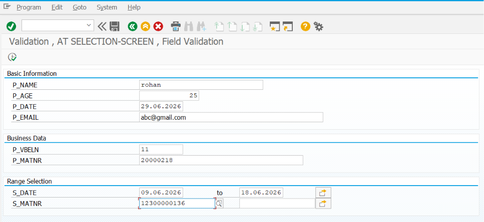
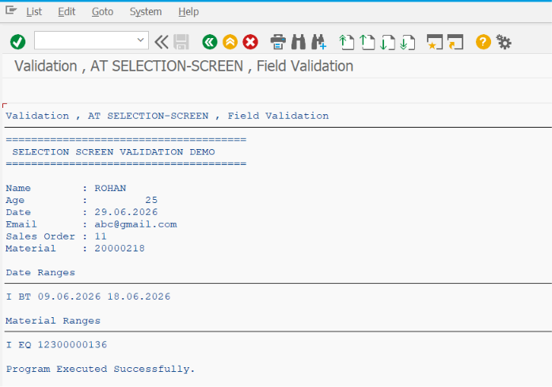

# ZSS_08_VALIDATION

> Demonstrates how to perform **Selection Screen Validations** in SAP ABAP using various `AT SELECTION-SCREEN` events to ensure users enter valid and consistent data before report execution.

---

# 📖 Overview

`ZSS_08_VALIDATION` is the eighth program in the **SAP ABAP Selection Screen Cookbook** series.

This program demonstrates how to validate user input on the Selection Screen before the report executes. Proper validation helps prevent incorrect or incomplete data from reaching the application logic, reducing runtime errors and improving data quality.

The example covers field-level validation, cross-field validation, mandatory checks, date validations, numeric validations, custom business rule validations, and displaying appropriate error, warning, and information messages.

---

# 📚 Topics Covered

- Selection Screen Validation
- `AT SELECTION-SCREEN`
- `AT SELECTION-SCREEN ON`
- `AT SELECTION-SCREEN ON END OF`
- `AT SELECTION-SCREEN ON BLOCK`
- Mandatory Field Validation
- Date Validation
- Numeric Validation
- Cross-Field Validation
- Range Validation
- Business Rule Validation
- Error Messages
- Warning Messages
- Information Messages
- Message Types (`E`, `W`, `I`, `S`)
- User Input Verification

---

# 🚀 Features Demonstrated

| Feature | Description |
|---------|-------------|
| Field Validation | Validate individual input fields |
| Block Validation | Validate all fields within a block |
| Select-Option Validation | Validate ranges entered by users |
| Date Validation | Check date ranges and future/past dates |
| Numeric Validation | Validate quantities, amounts, and limits |
| Mandatory Validation | Ensure required fields are entered |
| Cross-Field Validation | Compare values between multiple fields |
| Business Rules | Apply custom validation logic |
| Error Messages | Prevent report execution when input is invalid |
| Warning Messages | Alert users while allowing execution |
| Information Messages | Display guidance and notifications |
| Success Messages | Confirm successful validation when required |

---

# 📸 Selection Screen

> **Selection Screen Screenshot**

Add the screenshot below.

```markdown

```

---

# 📄 Output Screen

> **Output Screen Screenshot**

Add the screenshot below.

```markdown

```

---

# 💡 SAP Best Practices

- Validate all critical user input before processing report logic.
- Use field-level validation whenever possible to provide immediate feedback.
- Display meaningful and user-friendly error messages.
- Use `MESSAGE TYPE 'E'` to prevent invalid report execution.
- Use warning messages only when execution can safely continue.
- Avoid placing validation logic in `START-OF-SELECTION`; perform it on the Selection Screen.
- Keep validation logic modular and easy to maintain.
- Validate business rules in addition to technical data types.
- Use standard SAP domains and data elements where possible to reduce custom validations.
- Always consider user experience by providing clear instructions on how to correct invalid input.

---

# 📌 Notes

- `AT SELECTION-SCREEN` is the primary event for validating user input before report execution.
- `AT SELECTION-SCREEN ON <field>` validates a specific parameter or select-option.
- `AT SELECTION-SCREEN ON BLOCK <block>` validates all fields within a Selection Screen block.
- `AT SELECTION-SCREEN ON END OF <select-option>` is useful for validating complete ranges after the user finishes entering values.
- `MESSAGE TYPE 'E'` stops processing and returns the user to the Selection Screen.
- `MESSAGE TYPE 'W'` displays a warning but allows the user to continue.
- `MESSAGE TYPE 'I'` displays informational messages without indicating an error.
- Common validation scenarios include:
  - Date From must not be greater than Date To
  - Quantity must be greater than zero
  - Material Number must exist
  - Customer Number must be valid
  - Company Code must be authorized
  - Mandatory fields must not be left blank
- Proper validation improves report reliability, reduces incorrect data processing, and provides a better experience for business users.