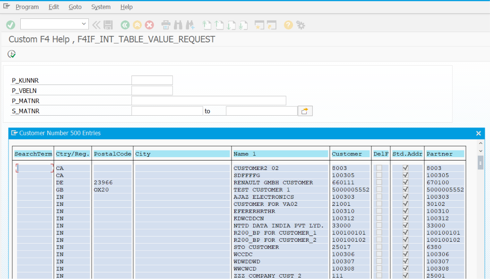
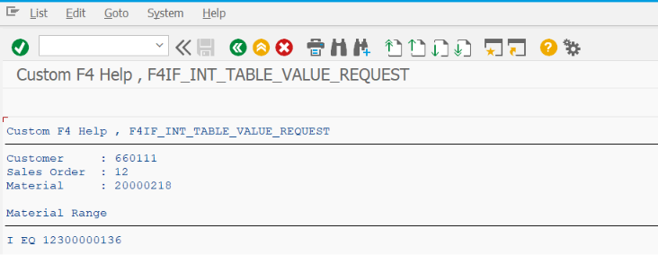

# ZSS_09_F4_HELP

> Demonstrates how to implement **Custom F4 Help (Search Help)** in SAP ABAP Selection Screens using standard SAP function modules, custom value lists, and database tables to provide users with an efficient and user-friendly value selection mechanism.

---

# 📖 Overview

`ZSS_09_F4_HELP` is the ninth program in the **SAP ABAP Selection Screen Cookbook** series.

This program demonstrates how to implement **Custom F4 Help (Search Help)** for Selection Screen fields. F4 Help allows users to search and select valid values instead of entering them manually, improving data accuracy and enhancing the user experience.

The example covers custom F4 Help for Parameters and Select-Options, fetching values from database tables, displaying custom value lists, and returning the selected value to the Selection Screen.

---

# 📚 Topics Covered

- F4 Help
- Search Help
- Custom Search Help
- Standard Search Help
- `AT SELECTION-SCREEN ON VALUE-REQUEST`
- `F4IF_INT_TABLE_VALUE_REQUEST`
- `F4IF_FIELD_VALUE_REQUEST`
- Value Help from Internal Table
- Value Help from Database Table
- Returning Selected Values
- Parameter F4 Help
- Select-Option F4 Help
- Search Help Exit (Introduction)
- User-Friendly Input Assistance

---

# 🚀 Features Demonstrated

| Feature | Description |
|---------|-------------|
| Custom F4 Help | Create custom value help for input fields |
| Standard Search Help | Use existing SAP search helps |
| Internal Table Value Help | Display values stored in an internal table |
| Database Value Help | Fetch searchable values from SAP tables |
| F4IF_INT_TABLE_VALUE_REQUEST | Display custom popup selection list |
| F4IF_FIELD_VALUE_REQUEST | Call standard field search help |
| Parameter F4 | Implement F4 Help for Parameters |
| Select-Option F4 | Implement F4 Help for Select-Options |
| Selected Value Return | Automatically populate the selected value |
| Search Popup | Display searchable selection popup |
| Dynamic Value Help | Display values based on business logic |
| Improved User Experience | Reduce manual typing and input errors |

---

# 📸 Selection Screen

# 📄 Output Screen

# 💡 SAP Best Practices

- Use standard SAP Search Helps whenever available.
- Create Custom F4 Help only when standard Search Helps do not satisfy the business requirement.
- Display meaningful descriptions along with technical keys.
- Limit the number of values displayed to improve search performance.
- Use `F4IF_INT_TABLE_VALUE_REQUEST` for custom value lists.
- Use `F4IF_FIELD_VALUE_REQUEST` when a standard dictionary search help already exists.
- Validate the selected value before processing the report.
- Avoid hard-coded values; retrieve value help dynamically from database tables or customizing tables.
- Design Search Helps that are simple, fast, and easy for business users to understand.
- Reuse existing Search Helps across reports whenever possible.

---

# 📌 Notes

- F4 Help is triggered using the `AT SELECTION-SCREEN ON VALUE-REQUEST` event.
- `F4IF_INT_TABLE_VALUE_REQUEST` is commonly used to display values from an internal table in a popup window.
- `F4IF_FIELD_VALUE_REQUEST` calls the standard SAP Search Help associated with a data element or database field.
- F4 Help can be implemented for both `PARAMETERS` and `SELECT-OPTIONS`.
- Custom Search Helps are useful when values need to be filtered or generated dynamically based on business rules.
- Typical business scenarios for F4 Help include:
  - Material Number
  - Customer Number
  - Vendor Number
  - Company Code
  - Plant
  - Sales Organization
  - Purchasing Organization
  - Storage Location
  - Cost Center
  - Profit Center
- A well-designed F4 Help reduces data entry errors, improves report usability, and increases user productivity.
- SAP standard applications extensively use Search Helps to provide fast and consistent value selection across the system.