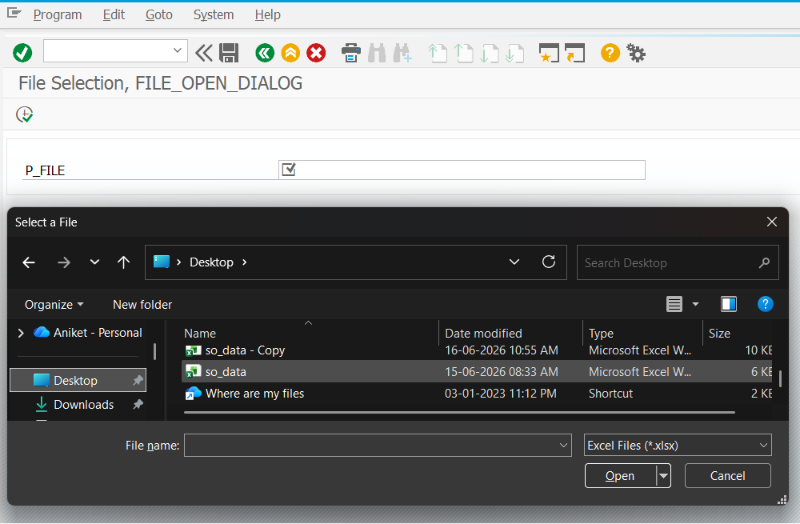
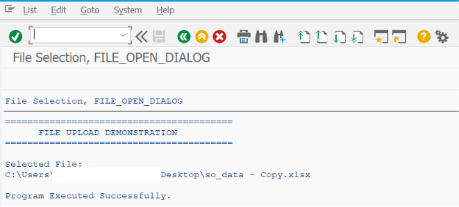

# ZSS_10_FILE_UPLOAD

> Demonstrates how to implement **File Upload** functionality in SAP ABAP Selection Screens using the SAP GUI Frontend Services class. The program allows users to browse, select, validate, and upload files from their local computer for further processing.

---

# 📖 Overview

`ZSS_10_FILE_UPLOAD` is the tenth program in the **SAP ABAP Selection Screen Cookbook** series.

This program demonstrates how to implement a complete file upload solution in SAP ABAP reports. It covers browsing files from the local system, validating the selected file, checking whether the file exists, and preparing the uploaded data for processing.

File upload functionality is one of the most commonly used features in real-world SAP ABAP developments, especially in data migration, master data uploads, transaction uploads, and interface programs.

The program uses the standard SAP GUI Frontend Services class to provide a user-friendly file selection dialog.

---

# 📚 Topics Covered

- File Upload
- Local File Selection
- File Browser
- Selection Screen File Upload
- `AT SELECTION-SCREEN ON VALUE-REQUEST`
- `CL_GUI_FRONTEND_SERVICES=>FILE_OPEN_DIALOG`
- `CL_GUI_FRONTEND_SERVICES=>FILE_EXIST`
- File Path Validation
- Local File Processing
- CSV File Selection
- Excel File Selection
- Text File Selection
- Upload Parameter
- Frontend Services
- User File Selection

---

# 🚀 Features Demonstrated

| Feature | Description |
|---------|-------------|
| File Upload Parameter | Accept file path from the user |
| Browse Button (F4) | Open Windows file selection dialog |
| File Open Dialog | Select files from the local computer |
| File Existence Check | Verify that the selected file exists |
| File Path Validation | Ensure a valid file path is entered |
| Supported File Types | CSV, TXT, XLS, XLSX (or custom filters) |
| User-Friendly File Selection | Eliminate manual typing of file paths |
| Selection Screen Integration | Upload file directly from the Selection Screen |
| Error Handling | Display messages for invalid or missing files |
| Ready for File Processing | Pass selected file for upload and parsing logic |

---

# 📸 Selection Screen

# 📄 Output Screen

# 💡 SAP Best Practices

- Use `CL_GUI_FRONTEND_SERVICES=>FILE_OPEN_DIALOG` instead of manually entering file paths.
- Validate that a file has been selected before processing.
- Check that the selected file exists using `FILE_EXIST`.
- Restrict file types to only those required by the business process.
- Display clear error messages when the selected file is invalid or cannot be found.
- Separate file selection logic from file processing logic for easier maintenance.
- Handle user cancellation gracefully without terminating the report unexpectedly.
- Use logical file names or Application Server uploads when frontend access is not appropriate.
- Ensure uploaded files follow the expected format before reading their contents.
- Test the upload process with different file types and file sizes.

---

# 📌 Notes

- File selection is typically implemented using the `AT SELECTION-SCREEN ON VALUE-REQUEST` event.
- `CL_GUI_FRONTEND_SERVICES=>FILE_OPEN_DIALOG` displays the standard Windows file browser for selecting local files.
- `CL_GUI_FRONTEND_SERVICES=>FILE_EXIST` verifies that the selected file exists before processing.
- The selected file path is automatically returned to the Selection Screen parameter.
- This program focuses on selecting and validating the file; reading and processing the file contents can be implemented in subsequent logic.
- Common business scenarios for file upload include:
  - Material Master Upload
  - Customer Master Upload
  - Vendor Master Upload
  - Sales Order Upload
  - Purchase Order Upload
  - Pricing Data Upload
  - Employee Data Upload
  - Bank Master Upload
  - Mass Data Migration
  - Interface File Processing
- File upload functionality is widely used in SAP migration projects, interfaces, automation programs, and data maintenance utilities.
- Always validate the uploaded file before processing to prevent incorrect or incomplete data from entering the SAP system.