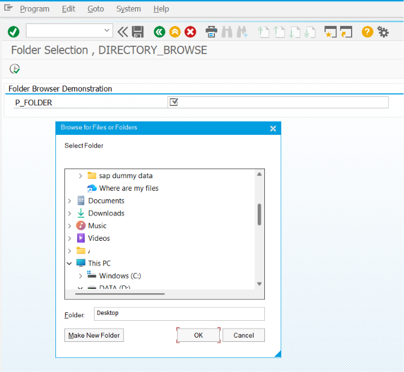
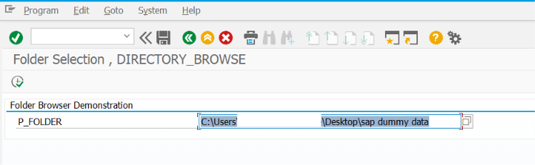

# ZSS_11_FOLDER_BROWSER

> Demonstrates how to implement a **Folder Browser** in SAP ABAP Selection Screens using the SAP GUI Frontend Services class. The program allows users to browse and select a folder from their local computer instead of manually entering a directory path.

---

# 📖 Overview

`ZSS_11_FOLDER_BROWSER` is the eleventh program in the **SAP ABAP Selection Screen Cookbook** series.

This program demonstrates how to implement a Folder Browser on the Selection Screen using the standard SAP GUI Frontend Services class. Instead of typing a directory path manually, users can select a folder through a graphical folder selection dialog.

Folder Browser functionality is commonly used in real-world SAP developments where reports need to save files, export reports, generate PDFs, download Smart Forms, or process multiple files from a selected directory.

The program uses the standard SAP GUI Frontend Services class to display the Windows Folder Selection dialog and return the selected folder path to the Selection Screen.

---

# 📚 Topics Covered

- Folder Browser
- Folder Selection Dialog
- Directory Selection
- Local Folder Selection
- Selection Screen Folder Input
- `AT SELECTION-SCREEN ON VALUE-REQUEST`
- `CL_GUI_FRONTEND_SERVICES=>DIRECTORY_BROWSE`
- Folder Path Validation
- Local Directory Selection
- Frontend Services
- Export Folder Selection
- Download Location Selection
- File System Navigation

---

# 🚀 Features Demonstrated

| Feature | Description |
|---------|-------------|
| Folder Path Parameter | Accept folder path from the user |
| Browse Folder (F4) | Open Windows folder selection dialog |
| Directory Browser | Select a folder from the local computer |
| Folder Path Validation | Validate that a folder has been selected |
| User-Friendly Folder Selection | Avoid manual typing of directory paths |
| Export Folder Selection | Choose a destination folder for downloads |
| Local Folder Navigation | Browse directories on the Presentation Server |
| Selection Screen Integration | Select folder directly from the Selection Screen |
| Error Handling | Handle invalid or cancelled folder selections |
| Ready for File Download | Use the selected folder for exporting reports or files |

---

# 📸 Selection Screen

> **Selection Screen Screenshot**

Add the screenshot below.

```markdown

```

---

# 📄 Output Screen

> **Output Screen Screenshot**

Add the screenshot below.

```markdown

```

---

# 💡 SAP Best Practices

- Use `CL_GUI_FRONTEND_SERVICES=>DIRECTORY_BROWSE` instead of asking users to type folder paths manually.
- Validate that a folder has been selected before processing.
- Handle user cancellation without generating unnecessary runtime errors.
- Keep folder selection logic separate from file processing or download logic.
- Use meaningful parameter labels such as **Download Folder** or **Export Directory**.
- Ensure the selected folder is accessible before attempting file creation.
- Display clear error messages if no folder is selected.
- Use folder browsing only for Presentation Server operations.
- For Application Server directories, use logical file paths instead of frontend folder browsing.
- Test folder selection on different SAP GUI versions when deploying reports.

---

# 📌 Notes

- Folder selection is typically implemented using the `AT SELECTION-SCREEN ON VALUE-REQUEST` event.
- `CL_GUI_FRONTEND_SERVICES=>DIRECTORY_BROWSE` opens the standard Windows Folder Selection dialog.
- The selected directory path is automatically returned to the Selection Screen parameter.
- Folder Browser functionality is available only when the report is executed through SAP GUI on the Presentation Server.
- This program focuses on selecting a folder; subsequent logic can use the selected path for downloading files or generating output documents.
- Common business scenarios for folder selection include:
  - ALV Report Download
  - Smart Form PDF Export
  - Excel Report Export
  - CSV File Generation
  - Batch File Download
  - Multiple File Export
  - Archive Folder Selection
  - Log File Storage
  - Interface Output Directory
  - Report Output Destination
- Folder Browser functionality improves usability by allowing users to select a valid directory through a graphical interface instead of manually entering file system paths.
- Always validate the selected folder before creating or downloading files to avoid processing errors.