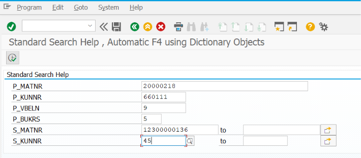
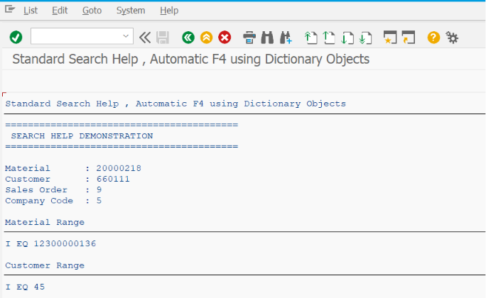

# ZSS_12_SEARCH_HELP

> Demonstrates how to use **SAP Dictionary Search Helps (DDIC Search Helps)** in SAP ABAP Selection Screens. This program shows how standard and custom Search Helps can be assigned to input fields, allowing users to search and select valid business data directly from SAP Dictionary objects.

---

# 📖 Overview

`ZSS_12_SEARCH_HELP` is the twelfth program in the **SAP ABAP Selection Screen Cookbook** series.

This program demonstrates how to use **SAP Dictionary Search Helps** to provide standard value help for Selection Screen fields. Unlike custom F4 Help, Search Helps are reusable Dictionary objects that can be assigned to data elements or directly to screen fields.

The example covers assigning Search Helps, understanding Elementary and Collective Search Helps, and using standard SAP Search Helps to improve data accuracy and user productivity.

Search Helps are widely used across SAP applications for selecting Materials, Customers, Vendors, Company Codes, Plants, Storage Locations, Sales Organizations, and other master data.

---

# 📚 Topics Covered

- Search Help
- SAP Dictionary (DDIC)
- Standard Search Help
- Custom Search Help
- Elementary Search Help
- Collective Search Help
- Search Help Assignment
- Search Help Parameters
- Search Help Interface
- Search Help Exit (Introduction)
- Data Element Search Help
- Domain Fixed Values
- Automatic F4 Help
- Search Help in Selection Screens
- Search Help in Screen Fields

---

# 🚀 Features Demonstrated

| Feature | Description |
|---------|-------------|
| Standard Search Help | Use SAP standard Dictionary Search Helps |
| Custom Search Help | Create and assign custom Search Helps |
| Automatic F4 Help | Display value help without additional coding |
| Data Element Search Help | Assign Search Help through Data Elements |
| Elementary Search Help | Use a single search method |
| Collective Search Help | Combine multiple search methods |
| Search Help Parameters | Configure import and export parameters |
| DDIC Integration | Reuse Search Helps across multiple applications |
| Business Object Search | Search Materials, Customers, Vendors, etc. |
| User-Friendly Value Selection | Improve data entry accuracy and speed |

---

# 📸 Selection Screen

> **Selection Screen Screenshot**

Add the screenshot below.

```markdown

```

---

# 📄 Output Screen

> **Output Screen Screenshot**

Add the screenshot below.

```markdown

```

---

# 💡 SAP Best Practices

- Use Standard SAP Search Helps whenever available before creating custom ones.
- Create Custom Search Helps only when business requirements cannot be fulfilled by standard SAP Search Helps.
- Assign Search Helps at the Data Element level whenever possible to maximize reusability.
- Display both technical keys and business descriptions in Search Help results.
- Use meaningful selection parameters to improve search performance.
- Restrict unnecessary records using selection methods or Search Help Exits.
- Keep Search Helps reusable across reports, module pools, and transactions.
- Use Collective Search Helps when users require multiple search methods.
- Test Search Helps with realistic business data volumes.
- Follow SAP naming conventions for custom Search Helps (for example, `ZSH_*` or `YSH_*`).

---

# 📌 Notes

- A Search Help is a reusable SAP Dictionary object that provides value help for input fields.
- Search Helps automatically provide F4 Help when assigned to a Data Element or screen field.
- No additional ABAP coding is required when a field already has an assigned Search Help.
- **Elementary Search Help** is based on a single selection method such as a table or view.
- **Collective Search Help** groups multiple Elementary Search Helps into one object.
- Search Help parameters define which values are imported into and exported from the Search Help.
- Search Help Exits can be used to dynamically filter or manipulate displayed values.
- Common SAP objects that use Search Helps include:
  - Material Number (`MATNR`)
  - Customer Number (`KUNNR`)
  - Vendor Number (`LIFNR`)
  - Company Code (`BUKRS`)
  - Plant (`WERKS`)
  - Storage Location (`LGORT`)
  - Sales Organization (`VKORG`)
  - Purchasing Organization (`EKORG`)
  - Cost Center (`KOSTL`)
  - Profit Center (`PRCTR`)
- Search Helps are a core SAP Dictionary feature that improves data consistency, enhances user productivity, and promotes reuse across the SAP system.