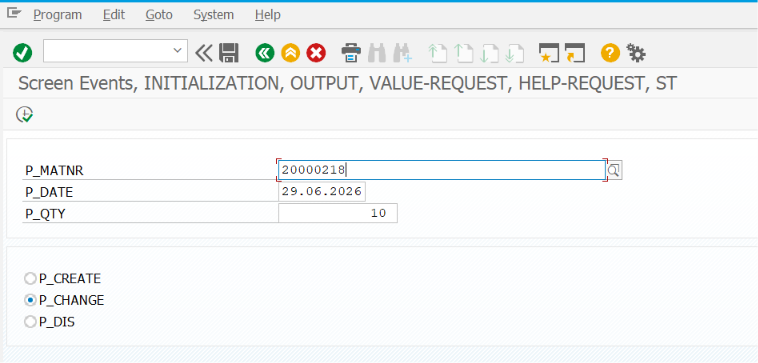
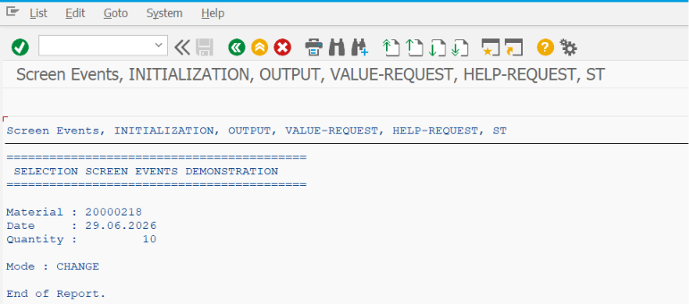

# ZSS_13_SELECTION_EVENTS

> Demonstrates all important **Selection Screen Events** in SAP ABAP. This program explains when each event is triggered, how it is used, and how different Selection Screen events work together to perform initialization, validation, dynamic screen modification, and custom user actions.

---

# 📖 Overview

`ZSS_13_SELECTION_EVENTS` is the thirteenth program in the **SAP ABAP Selection Screen Cookbook** series.

This program demonstrates the complete lifecycle of an SAP Selection Screen by covering all major Selection Screen events. It shows how to initialize default values, validate user input, provide F4 and F1 Help, react to push buttons and function keys, modify screen fields dynamically, and execute business logic after successful validation.

Selection Screen Events are one of the most important concepts in ABAP report programming and are widely used in real-world SAP developments.

---

# 📚 Topics Covered

- Selection Screen Events
- Event Sequence
- `INITIALIZATION`
- `AT SELECTION-SCREEN OUTPUT`
- `AT SELECTION-SCREEN`
- `AT SELECTION-SCREEN ON`
- `AT SELECTION-SCREEN ON END OF`
- `AT SELECTION-SCREEN ON BLOCK`
- `AT SELECTION-SCREEN ON RADIOBUTTON GROUP`
- `AT SELECTION-SCREEN ON VALUE-REQUEST`
- `AT SELECTION-SCREEN ON HELP-REQUEST`
- `AT SELECTION-SCREEN ON EXIT-COMMAND`
- `AT SELECTION-SCREEN ON FUNCTION KEY`
- `START-OF-SELECTION`
- Dynamic Screen Modification
- Field Validation
- Block Validation
- User Command Handling
- Custom F4 Help
- Custom F1 Help

---

# 🚀 Features Demonstrated

| Feature | Description |
|---------|-------------|
| INITIALIZATION Event | Set default values before the Selection Screen is displayed |
| Selection Screen Output | Dynamically enable, disable, hide, or modify screen fields |
| Field Validation | Validate individual fields using `AT SELECTION-SCREEN ON` |
| Block Validation | Validate all fields within a Selection Screen block |
| Select-Option Validation | Validate complete Select-Option ranges |
| Radio Button Validation | Validate radio button groups |
| F4 Help Event | Provide custom value help for input fields |
| F1 Help Event | Display custom help documentation |
| Push Button Handling | Execute custom logic using push buttons |
| Function Key Handling | Execute logic using application function keys |
| Exit Command Handling | Process Cancel, Back, or Exit actions |
| START-OF-SELECTION | Execute report logic after successful validation |
| Dynamic Screen Behavior | Modify screen elements during runtime |
| User Interaction Flow | Demonstrate complete Selection Screen event processing |

---

# 📸 Selection Screen

# 📄 Output Screen

# 💡 SAP Best Practices

- Use `INITIALIZATION` only for setting default values.
- Use `AT SELECTION-SCREEN OUTPUT` for dynamic screen modifications such as hiding or disabling fields.
- Validate individual fields using `AT SELECTION-SCREEN ON <field>` whenever possible.
- Group related validations using `AT SELECTION-SCREEN ON BLOCK`.
- Implement custom F4 Help using `AT SELECTION-SCREEN ON VALUE-REQUEST`.
- Implement custom F1 Help using `AT SELECTION-SCREEN ON HELP-REQUEST`.
- Use meaningful error messages to guide users when validation fails.
- Keep business processing inside `START-OF-SELECTION`; avoid placing business logic in Selection Screen events.
- Avoid duplicate validations across multiple events.
- Follow the standard SAP event sequence to ensure predictable program behavior.
- Separate screen logic from business logic to improve maintainability.
- Test all event flows, including invalid inputs, user cancellations, and dynamic field changes.

---

# 📌 Notes

- Selection Screen events are processed in a predefined sequence by the SAP runtime.
- `INITIALIZATION` is executed before the Selection Screen is displayed.
- `AT SELECTION-SCREEN OUTPUT` is triggered every time the Selection Screen is rendered or refreshed.
- `AT SELECTION-SCREEN` is executed after the user presses **Execute (F8)** or another action that triggers validation.
- `AT SELECTION-SCREEN ON <field>` validates a specific field.
- `AT SELECTION-SCREEN ON BLOCK` validates all fields within a Selection Screen block.
- `AT SELECTION-SCREEN ON END OF <select-option>` validates an entire Select-Option after all entries are completed.
- `AT SELECTION-SCREEN ON RADIOBUTTON GROUP` validates the selected radio button group.
- `AT SELECTION-SCREEN ON VALUE-REQUEST` is used to implement custom F4 Help.
- `AT SELECTION-SCREEN ON HELP-REQUEST` is used to implement custom F1 Help.
- `AT SELECTION-SCREEN ON EXIT-COMMAND` handles actions such as Back, Exit, or Cancel.
- `AT SELECTION-SCREEN ON FUNCTION KEY` handles custom application function keys.
- After all validations are completed successfully, `START-OF-SELECTION` is executed.
- Selection Screen Events are extensively used in reporting, data upload programs, interface reports, ALV reports, Smart Form driver programs, and custom business applications.
- Understanding the Selection Screen event sequence is essential for developing robust and user-friendly SAP ABAP reports.