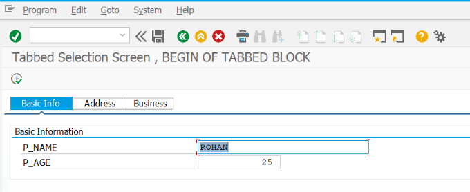
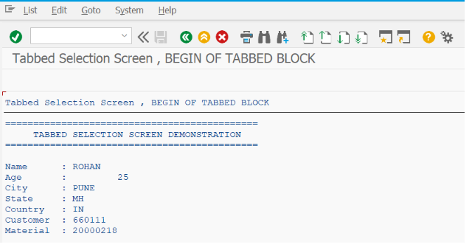

# ZSS_14_TABBED_SCREEN

> Demonstrates how to create **Tabbed Selection Screens** in SAP ABAP using subscreens. This program shows how multiple groups of input fields can be organized into separate tabs, providing a clean, user-friendly, and scalable interface for complex reports.

---

# 📖 Overview

`ZSS_14_TABBED_SCREEN` is the fourteenth program in the **SAP ABAP Selection Screen Cookbook** series.

This program demonstrates how to build a **Tabbed Selection Screen** using Selection Screen subscreens and the `TABBED BLOCK` statement. Instead of displaying all input fields on a single screen, related fields are grouped into separate tabs, making reports easier to use and maintain.

Tabbed Selection Screens are commonly used in large SAP reports where users need to enter different categories of information such as General Data, Organization Data, Date Filters, Advanced Options, Output Settings, and Download Parameters.

The program also demonstrates how to switch between tabs, initialize the default active tab, and organize screen elements for better usability.

---

# 📚 Topics Covered

- Tabbed Selection Screen
- Selection Screen Subscreens
- `SELECTION-SCREEN BEGIN OF TABBED BLOCK`
- Tab Titles
- Tab Assignment
- Active Tab Management
- `USER-COMMAND`
- Screen Navigation
- Screen Organization
- Multiple Selection Screens
- Screen Grouping
- Dynamic Tab Selection
- Default Active Tab
- Modular Screen Design
- Selection Screen Layout

---

# 🚀 Features Demonstrated

| Feature | Description |
|---------|-------------|
| Tabbed Block | Create multiple tabs within a Selection Screen |
| Subscreens | Organize input fields into separate subscreens |
| Default Active Tab | Display a predefined tab when the report starts |
| Multiple Input Groups | Separate related parameters into logical sections |
| User Command | Detect tab changes using `USER-COMMAND` |
| Clean Screen Layout | Reduce screen clutter by grouping fields |
| Navigation Between Tabs | Switch easily between different input sections |
| Modular Screen Design | Improve readability and maintainability |
| Scalable Report Design | Easily add new tabs without redesigning the screen |
| Business-Oriented Layout | Organize fields according to business processes |

---

# 📸 Selection Screen

# 📄 Output Screen

# 💡 SAP Best Practices

- Use Tabbed Selection Screens only when the report contains many input fields that can be logically grouped.
- Group related fields into meaningful tabs such as **General**, **Selection Criteria**, **Output Options**, or **Advanced Settings**.
- Keep tab titles short, descriptive, and business-friendly.
- Set a logical default active tab using the `INITIALIZATION` event.
- Avoid placing unrelated fields in the same tab.
- Use consistent field alignment and spacing across all tabs.
- Minimize unnecessary tab switching by organizing frequently used fields in the first tab.
- Keep validation logic separate from screen layout logic.
- Use `USER-COMMAND` when additional processing is required after a tab change.
- Design tabs so that additional business requirements can be accommodated with minimal changes.

---

# 📌 Notes

- A Tabbed Selection Screen is created using the `SELECTION-SCREEN BEGIN OF TABBED BLOCK` statement.
- Each tab displays a separate Selection Screen (subscreen).
- Only one tab is active and visible at a time.
- The active tab can be initialized during the `INITIALIZATION` event.
- Tab changes are processed using the `USER-COMMAND` associated with the tabbed block.
- Subscreens allow reports to be divided into smaller, reusable sections.
- Tabbed Selection Screens improve readability by reducing the number of fields displayed simultaneously.
- They are especially useful in reports with many selection criteria or multiple configuration options.
- Common real-world use cases include:
  - Sales Order Reports
  - Purchase Order Reports
  - Inventory Reports
  - Customer Master Reports
  - Vendor Master Reports
  - Financial Reports
  - Interface Programs
  - Data Migration Utilities
  - File Upload/Download Reports
  - ALV Reports with Advanced Filters
- Tabbed Selection Screens provide a professional and user-friendly interface while making complex reports easier to maintain and extend.